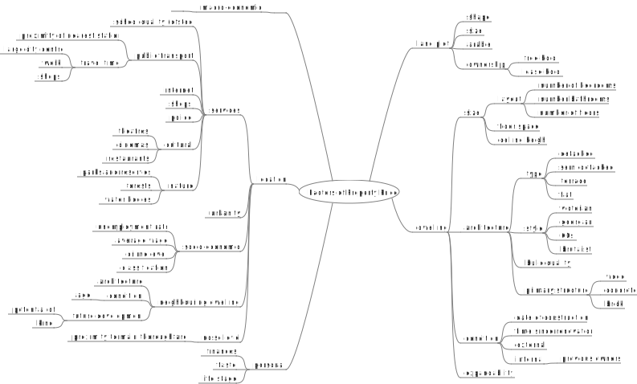

# Propertyy

Analysing house prices.

Intent is:
1. visualise property prices
2. model property prices to:
	- estimate risk of downturn
	- identify good buys: properties that are under expected value

### Factors of Property Price

## Data Sources

### Price Paid Data

1. http://landregistry.data.gov.uk
        - Everything: http://prod.publicdata.landregistry.gov.uk.s3-website-eu-west-1.amazonaws.com/pp-complete.csv
		- price paid data: http://landregistry.data.gov.uk/app/ppd/ppd_data

Property type

    detached
    semi-detached
    terraced
    flat/maisonette
    other

New build?

    new-build
    not new-build

Estate type

    freehold
    leasehold

Transaction category

    standard
    additional

| Data item | Explanation (where appropriate) |
| ------------- |:-------------|
| Transaction unique identifier |	A reference number which is generated automatically recording each published sale. The number is unique and will change each time a sale is recorded. |
| Price |	Sale price stated on the transfer deed.
| Date of Transfer |	Date when the sale was completed, as stated on the transfer deed. |
| Postcode |	This is the postcode used at the time of the original transaction. Note that postcodes can be reallocated and these changes are not reflected in the Price Paid Dataset. |
| Property Type |	D = Detached  S = Semi-Detached   T = Terraced   F = Flats/Maisonettes   O = Other   Note that: - we only record the above categories to describe property type, we do not separately identify bungalows. - end-of-terrace properties are included in the Terraced category above. - ‘Other’ is only valid where the transaction relates to a property type that is not covered by existing values.
| Old/New |	Indicates the age of the property and applies to all price paid transactions, residential and non-residential.   Y = a newly built property, N = an established residential building |
| Duration |	Relates to the tenure: F = Freehold, L= Leasehold etc.  Note that HM Land Registry does not record leases of 7 years or less in the Price Paid Dataset.|
| PAON |	Primary Addressable Object Name. Typically the house number or name. |
| SAON |	Secondary Addressable Object Name. Where a property has been divided into separate units (for example, flats), the PAON (above) will identify the building and a SAON will be specified that identifies the separate unit/flat. |
| Street |	  |
| Locality |	  |
| Town/City |	  |
| District 	 |  | 
| County 	 |  | 
| PPD Category Type |	Indicates the type of Price Paid transaction.   A = Standard Price Paid entry, includes single residential property sold for full market value.   B = Additional Price Paid entry including transfers under a power of sale/repossessions, buy-to-lets (where they can be identified by a Mortgage) and transfers to non-private individuals.

Note that category B does not separately identify the transaction types stated.
HM Land Registry has been collecting information on Category A transactions from January 1995. Category B transactions were identified from October 2013.
Record Status - monthly file only 	Indicates additions, changes and deletions to the records.(see guide below).
A = Addition
C = Change
D = Delete.

Note that where a transaction changes category type due to misallocation (as above) it will be deleted from the original category type and added to the correct category with a new transaction unique identifier.

The date field - the date of the transfer deed lodged with us for registration.

### Transaction Data

https://www.gov.uk/guidance/hm-land-registry-transaction-data

### Planning
1. Planning:
	a. Market Harborough: http://www.harborough.gov.uk/planning

